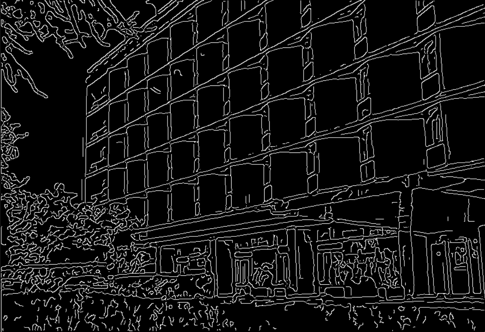
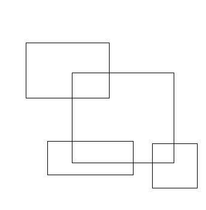
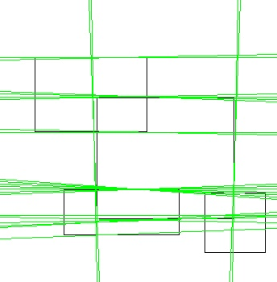
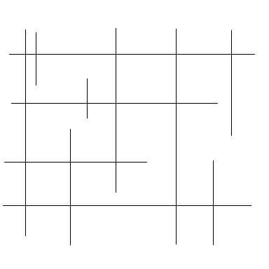
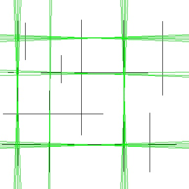
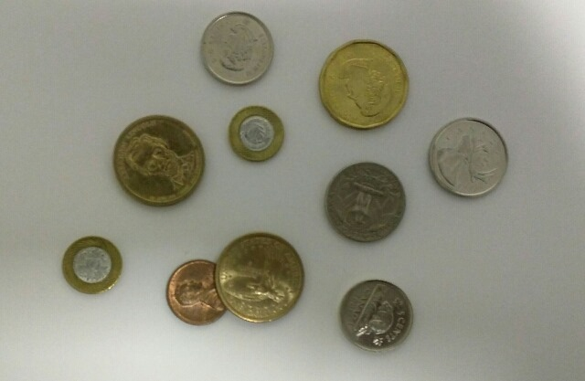
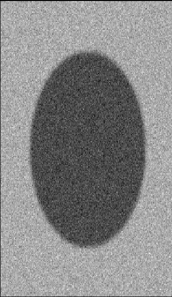
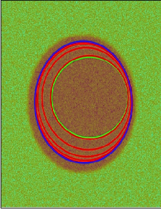

# Computer Vision Course - Group Task #2

---

# Team Work:

| Name | Section | Bench |
| ----------- | ----------- | ----------- |
| Ahmed Adel | 1 | 6 |
| Remon Albear | 1 | 33 |
| Abdulla Zahran | 2 | 4 |
| Mohammed Almotasem | 2 | 19 |

---

# Table of Content

| Requiered Part | Title |
| ----------- | ----------- |
| [#Part 1](#part-1) | Canny Edge Detection |
| [#Part 2](#part-2) | Hough Lines Cetection |
| [#Part 3](#part-3) | Hough Circles Cetection |
| [#Part 4](#part-4) | Active contour|

---
# Part 1

## Canny Edge Detection

The Canny edge detector is an edge detection operator that uses a multi-stage algorithm to detect a wide range of edges in images. It was developed in 1986. Canny also produced a computational theory of edge detection explaining why the technique works.

#### The Canny edge detection algorithm is composed of 5 stages:

#####1. Smoothing for noise removal.
   Since the mathematics involved behind the scene are mainly based on derivatives, edge detection results are highly sensitive to image noise.
   To get rid of the noise on the image, we apply Gaussian blur to smooth it. Image convolution technique is applied with a Gaussian Kernel. The kernel size depends on the expected blurring effect.
#####2. Finding Gradients.
   The Gradient calculation step detects the edge intensity and direction by calculating the gradient of the image using edge detection operators.
#####3. None-maximum suppression.
   We must perform non-maximum suppression to thin out the edges. The principle is simple: the algorithm goes through all the points on the gradient intensity matrix and finds the pixels with the maximum value in the edge directions.
#####4. Double Thresholding.
   The double threshold step aims at identifying 3 kinds of pixels: strong, weak, and non-relevant:
   Strong pixels: are pixels that have an intensity so high that we are sure they contribute to the final edge.
   Weak pixels: are pixels that have an intensity value that is not enough to be considered as strong ones, but yet not small enough to be considered as non-relevant for the edge detection.
   Other pixels: are considered as non-relevant for the edge.
#####5. Edge Tracking by hysteresis.
   Based on the threshold results, the hysteresis consists of transforming weak pixels into strong ones, if and only if at least one of the pixels around the one being processed is a strong one,

---

# Part 2 

## Hough Lines Detections
We implement hough algorithm to detect lines in images.
There are some parameters you can change it to adapt to your image like

    1. Number of lines to be detected 
    2. Length of the Lines
    3. Number of Rhos and Thetas
    4. Step of Rhos and thetas
### example 1
here is the input image

We detect the top 25 line with length 200 pixel by using 180 angle and 180 rho 
here is the output

### example 2
here is the input image

We detect the top 50 line with length 200 pixel by using 180 angle and 180 rho 
here is the output

---

# Part 3

## Hough Circles Detections
We implement hough algorithm to detect Cicles in images.
There are some parameters you can change it to adapt to your image like

    1. Minimum Radius
    2. Maximum Radius
    3. Step of Radius
    4. Number of Thetas
    5. Step of Thetas

### example 1
here is the input image

The parameters was minimum radius of 30 and maximum of 200 with step of 1 and 360 angles with step of 1 

here is the output

### example 2
here is the input image

The parameters was minimum radius of 15 and maximum of 200 with step of 1 and 360 angles with step of 1 

here is the output

---

# Part 4

## Active contour

this is the original image that we want to detect the boundaries of it.

Starting with initial guess for the boundary points, then shift the points around until they reach to the local minimum of the energy function.

