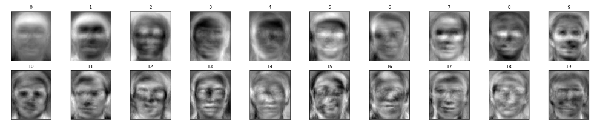

# Computer Vision Course - Group Task #5

---

# Team Work:

| Name | Section | Bench |
| ----------- | ----------- | ----------- |
| Ahmed Adel | 1 | 6 |
| Remon Albear | 1 | 33 |
| Abdulla Zahran | 2 | 4 |
| Mohammed Almotasem | 2 | 19 |

---

# Table of Content

| Requiered Part | Title |
| ----------- | ----------- |
| [#Part 1](#part-1) | Face Detection |
| [#Part 2](#part-2) | Face Recognition |
| [#Part 3](#part-3) | ROC |

---

# Part 1

## Face Detection
We used Open-Cv to detect faces in images (grayscale or rgb),by unsing pre-trained cascaded classifier
Results:

* 27 face are detected   

---

# Part 2 

## Face Recognition

---
### introduction

The objective of this project is to highlight the importance of linear algebra in the field of computer vision and face recognition. Eigenface is the name of a set of eigenvectors computed from an image dataset. Eigenvectors is a set of features which characterize the global variation among face images.The basis of the eigenfaces method is the Principal Component Analysis (PCA).PCA is a dimensionality-reduction method that is often used to reduce the dimensionality of large data sets, by transforming a large set of variables into a smaller one that still contains most of the information in the large set.

### Algorithm

* first if all we Obtain face image and represent every image in a n^2 x m matrix Image.
* Compute the Mean face vector(m).
* Then subtract each image with mean.
* Compute the eigen vectors(v).
* Select q eigenvectors(k).
* Now project new image into (k).
* The new image will be represented using the q eigenvectors(x).
* Face Detection
    * Subtract x with m.
    * If the difference is lower than a chosen threshold, the new image face is detected.
* Face Recognitio.
    * Each image is represented using the eigenvectors.
    * Each image is then subtracted with x.
    * If the difference is lower than a chosen threshold, the new image face is classified to a class.

two classes of the data set we use.

Mean image.

Each image when subtracted with the mean image.

Each image represented with q eigenvectors.

then as we said in the algorithm when enter a new image. we subtracr it from the mean image given us the x image, and compare the result with a choosen threshold. if the result is lower than the threshold, the image face is detected.

So, the image we use as input is ...

each image is represented using eigenvectors. So, Each image is then subtracted with x. If the difference is lower than a chosen threshold, the new image face is classified to a class.

the output image from the data set is ...

---
# Part 3

## ROC

