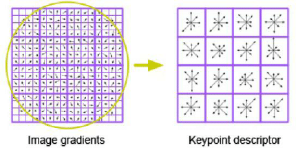

# Computer Vision Course - Group Task #3

---

# Team Work:

| Name | Section | Bench |
| ----------- | ----------- | ----------- |
| Ahmed Adel | 1 | 6 |
| Remon Albear | 1 | 33 |
| Abdulla Zahran | 2 | 4 |
| Mohammed Almotasem | 2 | 19 |

---

# Table of Content

| Requiered Part | Title |
| ----------- | ----------- |
| [#Part 1](#part-1) | Harris Operator|
| [#Part 2](#part-2) | SIFT |
| [#Part 3](#part-3) | Features Matching |

---

# Part 1
## Harris Operator
we implement a code for using harris operator to extract the features from images.
Here an image of cat we use as a sample to test our implementaion. 

then after applying the harris operator the output will be:

---

# Part 2 

## Scale Invarient Features Transform (SIFT)
We ued the SIFT algorithm to create descriptors of the key points generated from the Harris operator
The SIST algorithm consist of two parts:
1. Calculate Key Point Oriantation
2. Generate the key points Descriptors
### Key Point Oriantation
Calculate the main oriantation of the key point to used it in the next step to compute the relative oriantaion of each point in the kernal.

Steps:
* take kernal 16 * 16 around the point 
* compute the magnitude and oriantation of the gradient of this kernal 
* multiply the magnitude by guassian filter 
* claculate the histogram of this kernal where each bin is 10 degrees 
* take the biggest bin of the histogram and assign it to the point

### Key Point Descriptors
Steps:
1. take 16 * 16 kernal 
1. split it to 4 * 4 regions
1. for each region we compute the magnitude and oriantation of the gradient 
1. multiply the magnitude by guassian filter
1. compute the histogram for each region where each bin is 45 degrees 
1. we have 4 * 4 * 8 = 128 length descriptor  

---

# Part 3

## Template Matching:

we use the descriptors calculated from the last step to acheieve matching of features as required.

We used two methods to do the matching process:
1. Matching using Sum of square difference
   * Where we calculate the difference between the descriptor's vector elements, square them, add them and finally selecting the least sum which corresponds to the best match available
   

2. Matching using Normalized cross-correlation
   * Where we calculate the coorelation between the descriptor's vector elements, normalize the result and selecting the highest value of correlation which corresponds to the best match available
   

# Final Program

