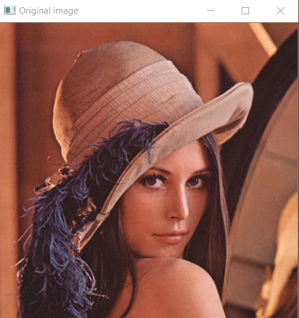
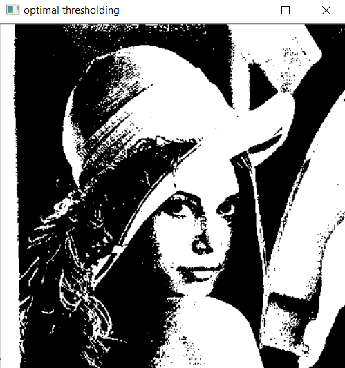
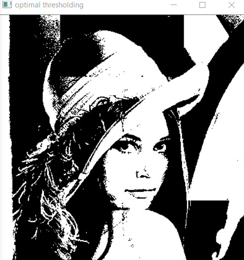
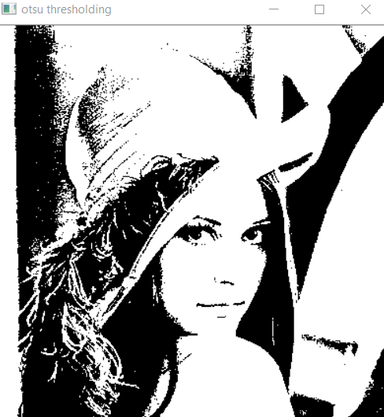
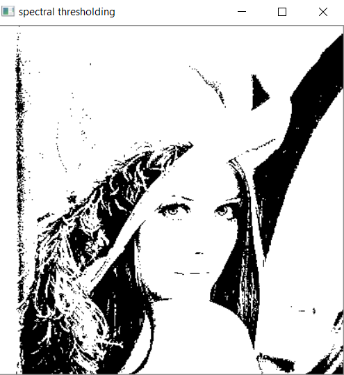
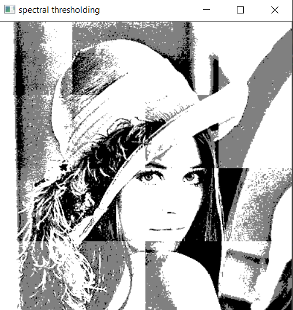
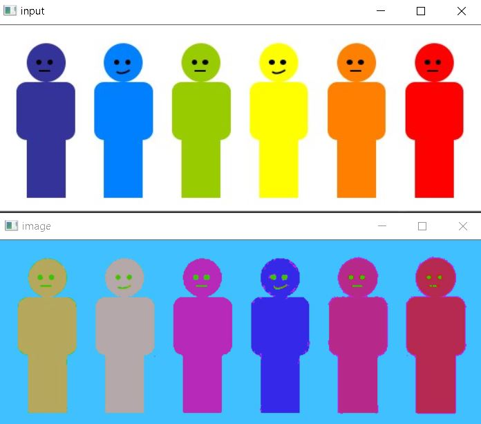
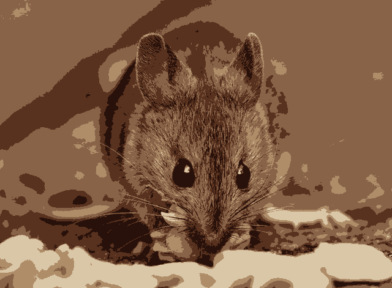

# Computer Vision Course - Group Task #4

---

# Team Work:

| Name | Section | Bench |
| ----------- | ----------- | ----------- |
| Ahmed Adel | 1 | 6 |
| Remon Albear | 1 | 33 |
| Abdulla Zahran | 2 | 4 |
| Mohammed Almotasem | 2 | 19 |

---

# Table of Content

| Requiered Part | Title |
| ----------- | ----------- |
| [#Part 1](#part-1) | Image Thresholding |
| [#Part 2](#part-2) | Image Segmentation |

---

# Part 1

## Image Thresholding

Image thresholding is mainly used to detect the edges found in a given picture, through choosing a suitable threshold; then applyingthis threshold and dividing the picture into two clusters: pixels with values than the the threshold which are set to 255 and others less than it which are set to 0.
Apllying the theshold can be done using mainly two methods: Global or Local thresholding.
But choosing the value of the threshold is the real trick and can be done by different techniques that will be displayed as follows on our "lena" image sample.

### 1. Optimal threshold
The optimal thresholding is done using by suing the means of the image and calculating the threshold using iteration to set pur two main reigons.
#### Global threshold

#### Local threshold

### 2. Otsu threshold
The Otsu algorithm is mainly based on select the threshold by calculating the between class variance for every value in the histogram and selecting the threshold based on the value that acheived the higher between class variance.
#### Global threshold

#### Local threshold

### 3. Spectral threshold
The spectral algorithm is acheieved by applying on e of the previous algorithm but using the three or more modes ie. Generalizing mode and calculating two or more thresholds and applying the thresholds to the selected image.
#### Global threshold

#### Local threshold

---

# Part 2 

## Image Segmentation
### Mean shift segementation

* 

* 

* 

### agglomerative segementation
in agglomerative we use 2 clusters. but in agglomerative file attached with the project you can change the number of clusters used.

input image

output image

### Kmeans segementation
in our program we use a fixed k = 2. but in Kmean file attached with the project you can change it and try different K.

input image

output image

### Region growing segementation
in our program we use a fixed piont to start the iteration. but in RegionGrowing file attached with the project you can run the file the image will show to you then choose from the image which point you want to start from by click on it by mouse, then close the window and the iteration will begin.

input image

output image

## Main Program working
